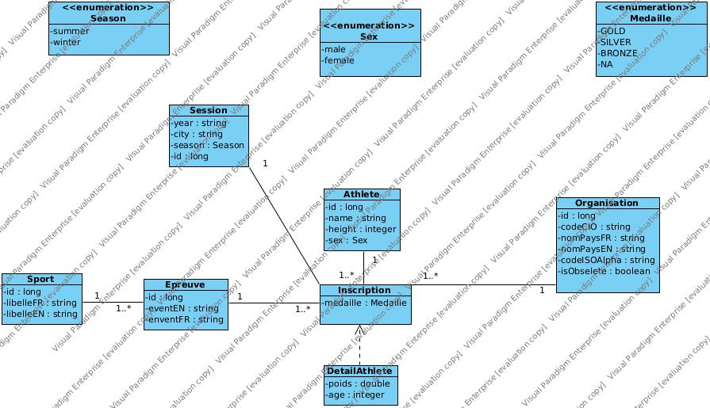
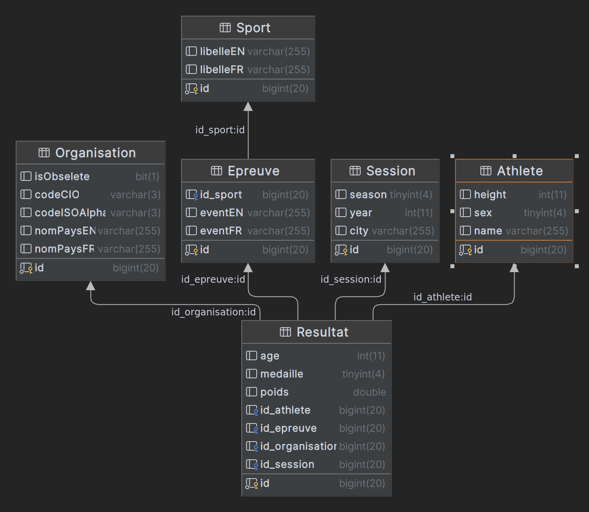
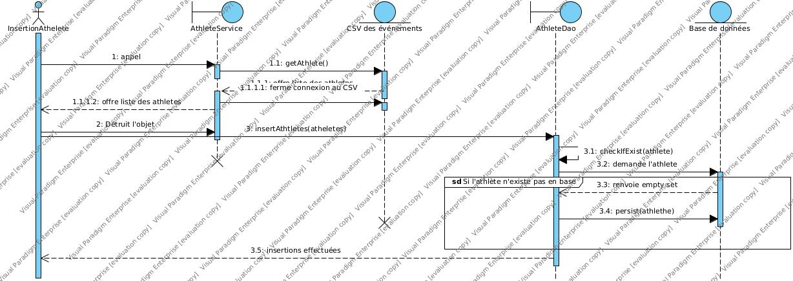

# Jeux Olympiques

Outil de parsing de fichier CSV dont le but est d'insérer en base toutes les données sur les jeux olympiques depuis 1970
en insérant aucun doublon et en créant une structure facilitant la recherche de résultat par année, athlète, etc.

## Conception du diagramme de classe des entités métier :

Le diagramme de classe :



Le modèle physique de données:



Ce diagramme a été conçu dans le but de structurer dans une classe d'association nommée résultat toutes les données
pouvant varier en fonction de la session à laquelle un athlète va participer.

Ainsi, on a remarqué les variables suivantes parmis celles suscpetibles de changer d'une années à l'autre:
 * Le poids de l'athlète.
 * L'âge de l'athlète.
 * L'organisation affiliée à l'athlète.

On a également remarqué, sur la session, les particularités suivantes :
 * Certains sports peuvent ne pas être présents dans lors de certaines sessions.

Un résultat associant un athlète à une épreuve sur une session, et l'organisation auquel est rafilié l'athlète dépendant
également de la session, l'idée d'une seule grande table d'association pour ces quatre entités semble être quelque chose
d'assez intuitif.

A noter que cette organisation peut tout de même poser des problèmes dans le requétage de la base de données:
 * Si l'on souhaite récupérer tous les sports présents à une session, cela demande de faire une requête ressemblant SQL
ressemblant à cela
```SQL
SELECT DISTINCT(sp.nom) 
FROM Session se
LEFT JOIN Resultat res ON se.id = res.session_id
LEFT JOIN Epreuve ep ON ep.id = res.epreuve_id
LEFT JOIN Sport sp ON sp.id = ep.id_sport
WHERE se.year = <year>;
```
Alors que l'on aimerai pouvoir faire quelque chose comme cela:
```SQL
SELECT sp.nom
FROM Sport sp
INNER JOIN Session_Sport ss ON ss.sport_id = sp.id
INNER JOIN Session se ON se.id = sp.session_id
WHERE se.year = <year>;
```
On pourrait donc rajouter un lien entre sport et session, mais il n'est pas absolument nécessaire pour l'objectif que 
l'on s'est donné, c'est à dire persister toutes les données sans perte d'information mais en évitant les doublons.
Pour le code de la première version de l'application nous nous baserons donc sur ce premier diagramme. Il reste toutefois
possible de rajouter un lien entre ces deux entités.

De la même façon, il est également nécessaire de passer par la table résultat pour voir toutes les organisations auxquelles
sont rafiliées un athlète.

Il est également nécessaire de passer par la table résultat pour voir toutes les organisations participant à une session.

Enfin, il est à noter que chaque épreuve possède une version féminine et une version masculine, et donc on pourrait
imaginer créer une table épreuve en lien avec une table sexe, et cela éviterait des doublons dans le nom des épreuves.
Toutefois, il est à noter que le libelle de certaines épreuves diffère entre homme et femme, du fait de certaines
catégories de poids ou de taille n'étant pas les même entre homme et femme.

Si l'on prenait toutes ces données en compte, on pourrait obtenir ce diagramme :


Ici, on peut observer un lien s'étant formé entre session et sport, créant donc une table d'association entre ces deux-ci
permettant de se passer du fait de devoir itérer sur tous les résultats des différents athlètes de la session pour trouver
tous les sports lui correspondant. Cela peut s'avérer pratique, mais également problématique, car il y a maintenant un lien
possible entre session et résultat qui permet de récupérer des résultats n'ayant rien à voir avec la session choisie
en passant de session à épreuve.

Nous avons également créé un lien entre athlète et organisations dans ce but: avec une table d'association entre les
deux, nous n'avons plus besoin d'itérer sur tous les résultats de l'ornganisation pour trouver les athlètes affiliés.
Toutefois, on perd dans cette table d'association l'actualité ou non de l'existence de l'athlète dans l'association, 
puisque l'information sur l'année à laquelle l'athlète appartient à l'association ne se trouve que dans résultats.
La pertinence de cet table de ce lien direct entre athlète et organisation est donc très dépendant du besoin que l'on
aura d'utiliser l'application pour trouver toutes les organisations avec lesquelles un athlète a participé, ou le
besoin de trouver tous les athlètes ayant un jour appartenu à une association.

## L'insertion des athlètes en base de données.

Une façon de faire pour insérer les athlètes en base de données peut ressembler à ce diagramme de séquence



Toutefois, cette solution n'a pas été retenu pour la création de l'application car elle présente plusieurs défauts 
d'optimisation.


Le but de cette application étant de traiter un fichier CSV de plus d'une centaine de milliers de ligne, nous n'allons
pas charger la totalité des données sur les athlètes en mémoire, car cela serait bien trop gros et la solution ne serait
pas scalable à un fichier d'un million de lignes par exemple. Nous allons donc ici faire le diagramme des solutions que 
nous allons mettre en oeuvre pour insérer les données sur les athlètes en base sans faire de duplicat. 


